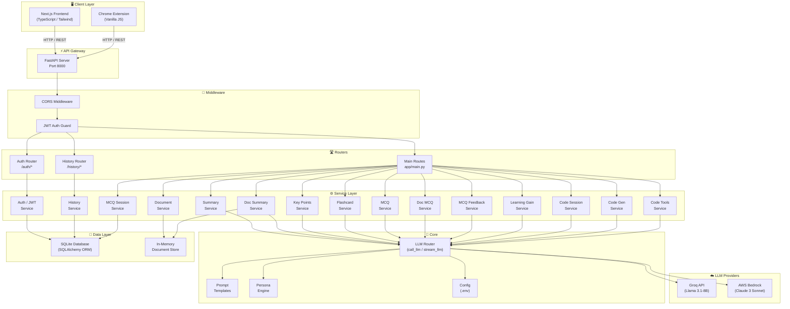
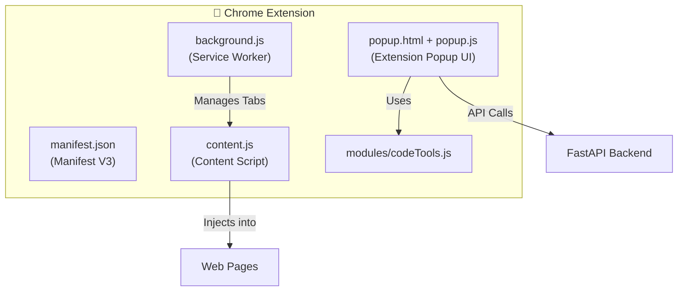
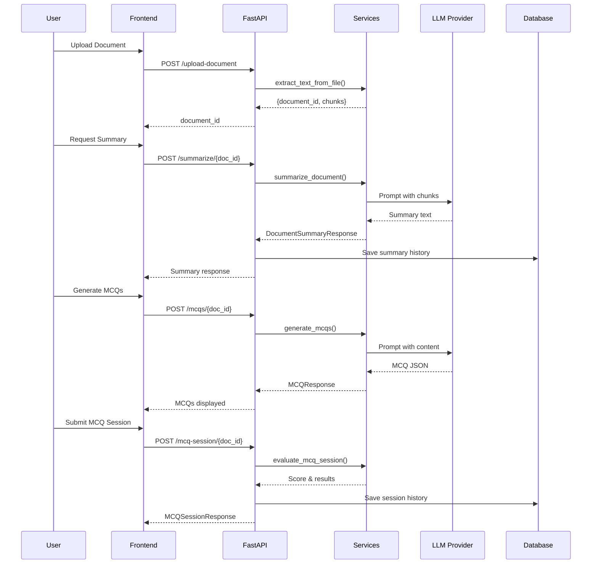
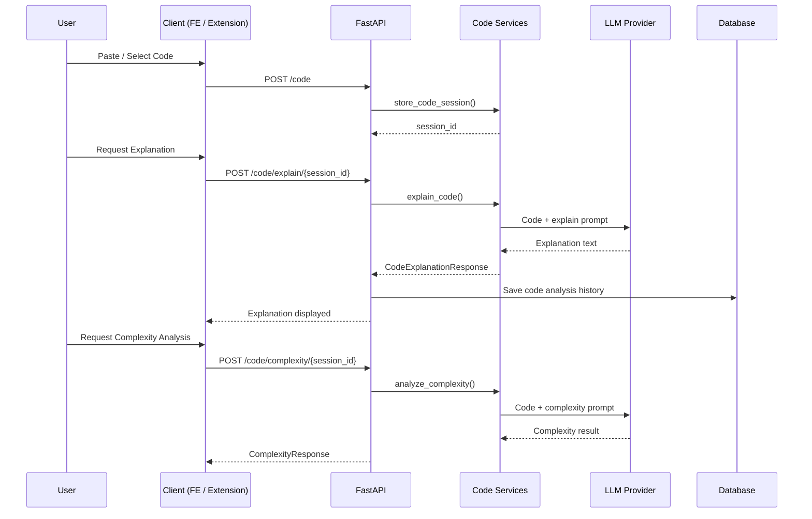
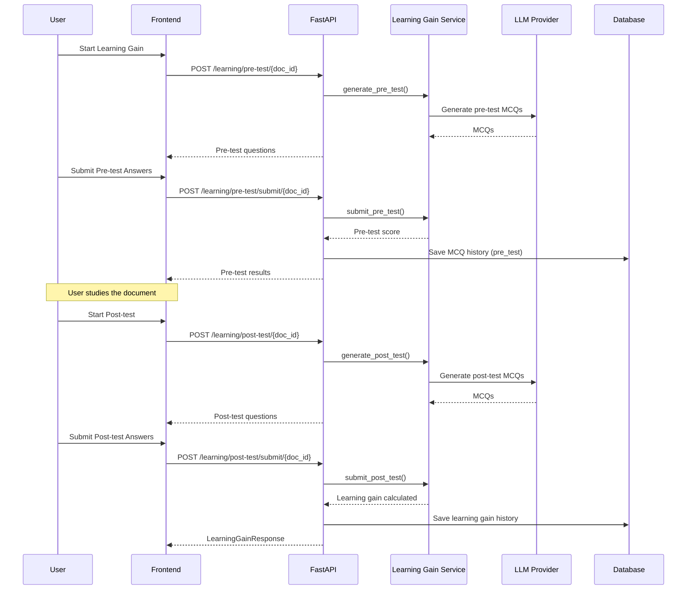
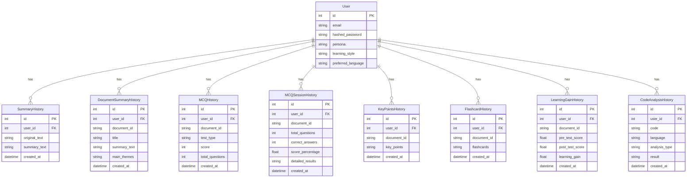

# AI Learning Platform — Architecture Flowchart

## High-Level System Architecture

---

## Frontend Architecture (Next.js)

```mermaid
graph LR
    subgraph PAGES["📄 Pages (App Router)"]
        LP["/ (Landing)"]
        LOGIN["/login"]
        REG["/register"]
        DASH["/(dashboard)"]
        HIST["/history"]
        PROF["/profile"]
    end

    subgraph COMPONENTS["🧩 Components"]
        NAV["Navbar"]
        PR["ProtectedRoute"]
        UP["Upload"]
        SUM["Summary"]
        SIMP["Simplify"]
        MCQ["MCQ"]
        FC["Flashcards"]
        LG["Learning Gain"]
        CODE["Code Analysis"]
        COMMON["Common UI"]
        LAYOUT["Layout"]
        DASHC["Dashboard"]
    end

    subgraph CONTEXTS["🔄 Contexts"]
        DC["DocumentContext"]
        PC["PersonaContext"]
        TC["ThemeContext"]
    end

    subgraph LIB["📚 Lib"]
        API["api.ts<br/>(apiRequest + JWT)"]
        CAPI["codeApi.ts"]
        CONAPI["conceptApi.ts"]
        AUTH["auth.ts"]
    end

    PAGES --> COMPONENTS
    COMPONENTS --> CONTEXTS
    COMPONENTS --> LIB
    LIB -->|"fetch()"| BACKEND["FastAPI Backend"]
```

---

## Chrome Extension Architecture

---

## Data Flow: Document Learning Pipeline

---

## Data Flow: Code Analysis Pipeline

---

## Data Flow: Learning Gain Assessment

---

## Database Model Relationships

---

## Technology Stack Summary

| Layer | Technology |
|---|---|
| **Frontend** | Next.js 14, TypeScript, Tailwind CSS |
| **Chrome Extension** | Vanilla JS, Manifest V3 |
| **Backend** | Python, FastAPI, Uvicorn |
| **Database** | SQLite (via SQLAlchemy ORM) |
| **Auth** | JWT (python-jose), bcrypt |
| **LLM - Primary** | Groq API (Llama 3.1-8B-Instant) |
| **LLM - Alternate** | AWS Bedrock (Claude 3 Sonnet) |
| **File Processing** | PyPDF2, python-docx |
| **HTTP Client** | httpx (async), boto3 (AWS) |
