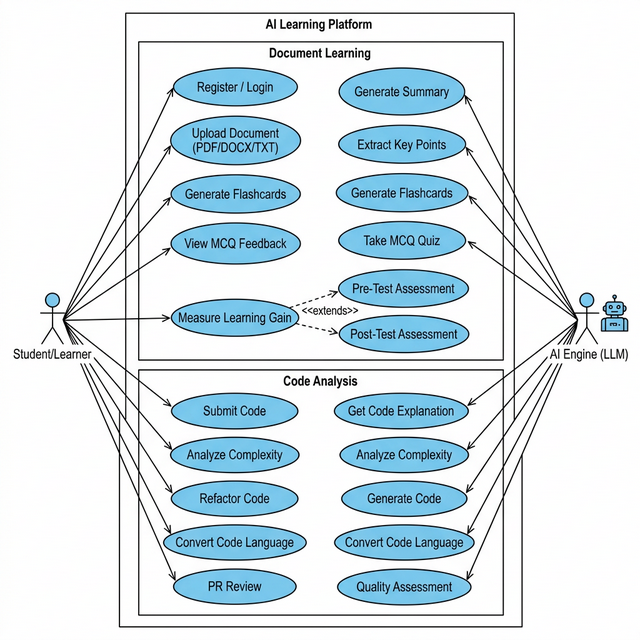
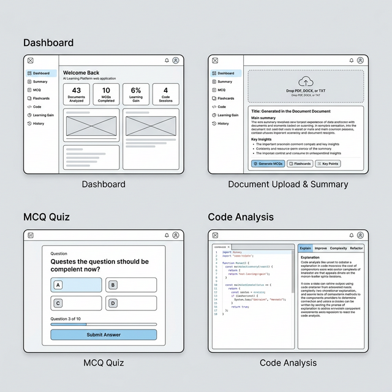
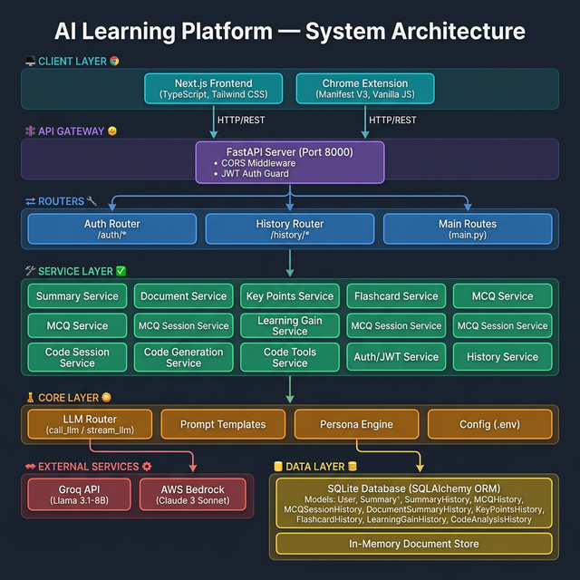

# AI Learning Platform — Presentation Slide Content
### *Slide-by-slide content for project submission*

---

# SLIDE 1 — Brief About the Idea

## AI Learning Platform: Persona-Adaptive Intelligent Learning

**The Problem:**
Traditional e-learning tools deliver the same explanation to everyone — a beginner, a university student, and a senior developer all see identical content. This one-size-fits-all approach leads to poor comprehension, wasted time, and disengagement.

**Our Idea:**
An AI-powered learning platform that **adapts its teaching style to each user's expertise level**. The platform uses Large Language Models (LLMs) to process documents and code, generating personalized summaries, quizzes, flashcards, and code analysis — all tailored to whether the user is a **Beginner**, a **Student**, or a **Senior Developer**.

**Key Innovation — Persona Engine:**
- **Beginner** → Simple language, real-world analogies, no jargon, step-by-step explanations
- **Student** → Academic tone, structured paragraphs, proper CS terminology, conceptual depth
- **Senior Dev** → Engineering critique, Big-O analysis, design pattern review, scalability assessment

**Three delivery channels:**
1. **Web Dashboard** — Full-featured Next.js application for document and code analysis
2. **Chrome Extension** — Instant code analysis directly in the browser
3. **REST API** — 27+ endpoints for programmatic integration

---

# SLIDE 2 — Why AI? How AWS? What Value?

## Why AI is Required in This Solution

AI is not a buzzword in this project — it is the **core engine** that powers every feature:

| Feature | Why AI is Essential |
|---|---|
| **Document Summarization** | AI understands context, extracts meaning, and condenses 50-page documents into structured summaries with key themes |
| **MCQ Generation** | AI creates relevant, difficulty-graded questions WITH correct answers and explanations — impossible without language understanding |
| **Flashcard Generation** | AI identifies the most important Q&A pairs from any document |
| **Code Explanation** | AI can explain code in natural language, adapting depth by persona |
| **Complexity Analysis** | AI provides Big-O analysis and identifies performance bottlenecks |
| **Code Refactoring** | AI suggests cleaner, more efficient implementations |
| **Learning Gain Measurement** | AI generates distinct pre-test and post-test questions to measure actual knowledge gain |
| **Persona Adaptation** | AI dynamically adjusts vocabulary, tone, depth, and examples based on user profile |

**Without AI, every one of these features would require manual content creation by human experts, making the platform impractical to scale.**

## How AWS Services Are Used

| AWS Service | Usage in Architecture |
|---|---|
| **AWS Bedrock** | Alternative LLM provider — hosts Claude 3 Sonnet for high-quality AI inference. Provides enterprise-grade, scalable AI without managing GPU infrastructure |
| **AWS Region Config** | Configurable via `AWS_REGION` environment variable (default: `us-east-1`) |
| **Future: S3** | Document storage for uploaded PDFs, DOCX files (config placeholder already exists in `config.py`) |
| **Future: Lambda** | Serverless function execution for background processing |

**AWS Bedrock** serves as the **enterprise-grade LLM provider**. The platform's LLM Router pattern (`call_llm()`) allows seamless switching between:
- **Groq API** (Llama 3.1-8B) — Fast, cost-effective for development
- **AWS Bedrock** (Claude 3 Sonnet) — Production-ready, enterprise security, no rate limits

## What Value the AI Layer Adds to User Experience

1. **Instant Learning Materials** — Upload any document and get a complete study kit (summary, flashcards, MCQs) in seconds, not hours
2. **Personalized Experience** — A beginner sees "imagine sorting books on a shelf" while a senior dev sees "O(n log n) divide-and-conquer with merge overhead"
3. **Measurable Progress** — Pre/post test system quantifies actual learning gain as a percentage
4. **Code Mastery** — Paste any code snippet and get explanation, improvement suggestions, complexity analysis, and refactored version instantly
5. **No Content Creation Overhead** — AI generates all learning materials dynamically from any source document

---

# SLIDE 3 — List of Features

## Complete Feature List

### 📄 Document Processing
- Upload PDF, DOCX, and TXT documents (up to 50MB)
- Automatic text extraction and intelligent chunking
- In-memory document store with session persistence

### 📝 AI-Powered Summaries
- Structured summaries with title, body, and main themes
- Concept tags with weighted relevance scores (1–10)
- Streaming summaries (word-by-word progressive display)

### 🧠 Key Points Extraction
- 5–10 clear, concise key points from any document
- Auto-saved to user history

### 🃏 Flashcard Generation
- Question-Answer flashcard pairs generated from document content
- Interactive flip-card UI

### ❓ MCQ Quiz System
- Auto-generated MCQs with 4 options each
- Difficulty grading (easy / medium / hard)
- Per-question instant feedback with explanation
- Full session scoring with detailed results

### 📊 Learning Gain Measurement
- Pre-test → Study → Post-test pipeline
- Quantitative learning gain percentage calculation
- Complete history tracking

### 💻 Code Analysis Suite (10 tools)
1. **Code Explanation** — Natural language breakdown, persona-adaptive
2. **Code Improvement** — Suggestions with rationale
3. **Complexity Analysis** — Time & space complexity with Big-O
4. **Code Refactoring** — Cleaner implementation
5. **Step-by-Step Explanation** — Line-by-line walkthrough
6. **Architecture Analysis** — Design pattern evaluation
7. **Refactor Impact Comparison** — Before vs. after complexity
8. **Code Quality Score** — Readability, efficiency, maintainability scores
9. **Code Generation** — From description to working code
10. **Language Conversion** — Convert between programming languages

### 🔧 Advanced Code Tools
- **PR Review** — Pull request diff analysis
- **Inline Explanation** — Line-by-line annotations
- **Code Block Detection** — Extract code from web pages

### 🎭 Persona System
- 3 personas: Beginner, Student, Senior Developer
- Per-user persona preference stored in profile
- Dynamic switching at request time via query parameter

### 🔐 Authentication & User Management
- Email/password registration with persona selection
- JWT token-based authentication
- Profile management (persona, learning style, preferred language)
- Protected endpoints with auth guard

### 📜 Activity History
- Complete history for all features (summaries, MCQs, flashcards, code analysis, learning gain)
- Per-user isolation
- Timestamped entries

### 🌐 Chrome Extension
- Browser-native code analysis
- All 10 code tools accessible from any web page
- Content script for code block detection

---

# SLIDE 4 — Process Flow Diagram / Use-Case Diagram

## Use-Case Diagram



## Core Process Flow: Document Learning Pipeline

```
┌──────────┐    ┌──────────────┐    ┌────────────────┐    ┌──────────────┐
│  User    │───▶│  Upload      │───▶│  AI Processes  │───▶│  Results     │
│  Login   │    │  Document    │    │  Document      │    │  Dashboard   │
└──────────┘    └──────────────┘    └────────────────┘    └──────────────┘
                      │                     │                     │
                      ▼                     ▼                     ▼
               ┌──────────────┐    ┌────────────────┐    ┌──────────────┐
               │  Text        │    │  • Summary     │    │  • View      │
               │  Extraction  │    │  • Key Points  │    │  • Download  │
               │  & Chunking  │    │  • Flashcards  │    │  • History   │
               └──────────────┘    │  • MCQs        │    └──────────────┘
                                   └────────────────┘
                                          │
                                          ▼
                                   ┌────────────────┐
                                   │ Learning Gain  │
                                   │ Pre → Study →  │
                                   │ Post → Score   │
                                   └────────────────┘
```

## Core Process Flow: Code Analysis Pipeline

```
┌──────────┐    ┌──────────────┐    ┌────────────────┐    ┌──────────────┐
│  User    │───▶│  Paste /     │───▶│  AI Analysis   │───▶│  Results     │
│  Login   │    │  Submit Code │    │  Engine        │    │  Panel       │
└──────────┘    └──────────────┘    └────────────────┘    └──────────────┘
                      │                     │                     │
                      ▼                     ▼                     ▼
               ┌──────────────┐    ┌────────────────┐    ┌──────────────┐
               │  Code        │    │  • Explain     │    │  • Display   │
               │  Session     │    │  • Improve     │    │  • Compare   │
               │  Created     │    │  • Complexity  │    │  • Save to   │
               └──────────────┘    │  • Refactor    │    │    History   │
                                   │  • Generate    │    └──────────────┘
                                   │  • Convert     │
                                   │  • PR Review   │
                                   └────────────────┘
```

---

# SLIDE 5 — Wireframes / Mock Diagrams

## Application Wireframes



### Screen Descriptions

| Screen | Description |
|---|---|
| **Dashboard** | Landing page after login. Shows learning stats (docs analyzed, MCQs completed, learning gain %). Sidebar navigation to all features. |
| **Document Upload & Summary** | Drag-and-drop file upload area. After upload, AI generates summary with title, body, themes. Action buttons to generate MCQs, flashcards, key points. |
| **MCQ Quiz** | Interactive quiz with one question at a time. Four options (A–D) as clickable cards. Progress bar. Instant feedback with explanation after each answer. |
| **Code Analysis** | Split-panel layout. Left: Monaco code editor with syntax highlighting and line numbers. Right: Analysis results with tab switching (Explain, Improve, Complexity, Refactor, Quality). |

### Additional Screens (not shown)

- **Login / Register** — Email, password, persona selector (Beginner / Student / Senior Dev)
- **Flashcards** — Flip-card interface with Question → Answer reveal
- **Learning Gain** — Pre-test → post-test flow with progress visualization
- **History** — Table/list view of all past activities with filters
- **Profile** — Settings for persona, learning style, preferred language
- **Chrome Extension Popup** — Compact code tools panel accessible from browser toolbar

---

# SLIDE 6 — Architecture Diagram

## System Architecture



### Architecture Layers

| Layer | Components | Responsibility |
|---|---|---|
| **Client** | Next.js Frontend, Chrome Extension | User interface, API consumption |
| **API Gateway** | FastAPI + CORS + JWT Guard | Request routing, authentication, validation |
| **Routers** | Auth Router, History Router, Main Routes | Endpoint definitions, request delegation |
| **Services** | 18 business logic services | Feature implementation, LLM interaction |
| **Core** | LLM Router, Prompts, Persona, Config | AI orchestration, prompt engineering |
| **External** | Groq API, AWS Bedrock | LLM inference providers |
| **Data** | SQLite + In-Memory Store | Persistence, session management |

### Key Architectural Decisions

1. **Provider Abstraction** — `call_llm()` abstracts LLM providers, enabling one-line switching between Groq and AWS Bedrock
2. **Dual Prompt System** — System prompt (persona rules) + User prompt (task instructions) work together for persona-adaptive AI
3. **Stateless API + Stateful Sessions** — REST API is stateless (JWT), but code and document sessions use server-side in-memory stores
4. **History-By-Default** — Every authenticated action is automatically saved to the database

---

# SLIDE 7 — Technologies Utilized

## Full Technology Stack

### Backend

| Technology | Version | Purpose |
|---|---|---|
| **Python** | 3.10+ | Core programming language |
| **FastAPI** | 0.109.0 | High-performance async web framework |
| **Uvicorn** | 0.27.0 | ASGI server |
| **SQLAlchemy** | 2.0+ | ORM for database operations |
| **SQLite** | Built-in | Lightweight relational database |
| **Pydantic** | 2.5.3 | Data validation and serialization |
| **httpx** | 0.26.0 | Async HTTP client (Groq API calls) |
| **boto3** | Latest | AWS SDK for Bedrock integration |
| **python-jose** | 3.3+ | JWT token creation and validation |
| **passlib[bcrypt]** | 1.7+ | Secure password hashing |
| **PyPDF2** | 3.0.1 | PDF text extraction |
| **python-docx** | 1.1.0 | DOCX text extraction |

### Frontend

| Technology | Version | Purpose |
|---|---|---|
| **Next.js** | 16.1.6 | React framework with App Router |
| **React** | 18.3.0 | UI component library |
| **TypeScript** | 5.x | Type-safe JavaScript |
| **Tailwind CSS** | 3.4.1 | Utility-first CSS framework |
| **Framer Motion** | 11.0.0 | Smooth animations and transitions |
| **Monaco Editor** | 4.7.0 | VS Code-quality code editor |
| **Radix UI** | Various | Accessible UI primitives |
| **Lucide React** | 0.344.0 | Icon library |

### Chrome Extension

| Technology | Purpose |
|---|---|
| **Manifest V3** | Latest Chrome extension standard |
| **Vanilla JavaScript** | Lightweight, no framework dependencies |
| **Content Scripts** | Page-level code detection |
| **Service Workers** | Background event handling |

### AI / LLM

| Technology | Purpose |
|---|---|
| **Groq API** (Llama 3.1-8B-Instant) | Primary LLM — fast inference, cost-effective |
| **AWS Bedrock** (Claude 3 Sonnet) | Enterprise LLM — production-grade, scalable |
| **Custom Prompt Engineering** | Task-specific and persona-adaptive prompt templates |

---

# SLIDE 8 — Estimated Implementation Cost

## Cost Breakdown

### Development Cost (One-Time)

| Component | Estimated Effort | Cost Estimate (USD) |
|---|---|---|
| Backend API (FastAPI, 27 endpoints) | ~120 hours | $6,000 – $12,000 |
| Frontend (Next.js, 10+ components) | ~80 hours | $4,000 – $8,000 |
| Chrome Extension | ~30 hours | $1,500 – $3,000 |
| Persona Engine + Prompt Engineering | ~40 hours | $2,000 – $4,000 |
| Auth System (JWT, bcrypt) | ~20 hours | $1,000 – $2,000 |
| Testing & QA | ~30 hours | $1,500 – $3,000 |
| **Total Development** | **~320 hours** | **$16,000 – $32,000** |

### Monthly Operating Cost (Cloud Deployment)

| Service | Estimated Monthly Cost |
|---|---|
| **Groq API** (Llama 3.1-8B) — 100K requests/month | $10 – $50 (very cost-effective) |
| **AWS Bedrock** (Claude 3 Sonnet) — 10K requests/month | $30 – $150 |
| **Hosting** (EC2 t3.medium or equivalent) | $30 – $50 |
| **Database** (SQLite → RDS PostgreSQL for production) | $0 – $20 |
| **Domain & SSL** | $15 |
| **Total Monthly** | **$85 – $285** |

### Key Cost Advantage
Using **Groq's free tier** and **SQLite** during development brings the prototype operational cost to essentially **$0/month**, making it ideal for academic projects and proof-of-concepts.

---

# SLIDE 9 — Snapshots of the Prototype

> **Note**: Since the application needs to be running locally to capture live screenshots, the following describes the key screens available in the prototype. To capture actual screenshots, run the backend and frontend servers:
>
> ```bash
> # Terminal 1 — Backend
> cd ai-learning-platform
> uvicorn app.main:app --host 0.0.0.0 --port 8000 --reload
>
> # Terminal 2 — Frontend
> cd ai-learning-platform/frontend
> npm run dev
> ```
> Then visit `http://localhost:3000`

### Available Prototype Screens

| Screen | Route | What It Demonstrates |
|---|---|---|
| **Login Page** | `/login` | Email/password auth with clean UI |
| **Registration** | `/register` | Persona selection (Beginner/Student/Senior Dev) |
| **Dashboard** | `/(dashboard)` | Feature hub with navigation sidebar |
| **Document Upload** | Dashboard → Upload | Drag-and-drop PDF/DOCX/TXT upload |
| **AI Summary** | Dashboard → Summary | Generated structured summary with themes |
| **MCQ Quiz** | Dashboard → MCQ | Interactive quiz with instant feedback |
| **Flashcards** | Dashboard → Flashcards | Flip-card study tool |
| **Learning Gain** | Dashboard → Learning Gain | Pre/post test with % gain |
| **Code Analysis** | Dashboard → Code | Monaco editor + multi-tool analysis panel |
| **History** | `/history` | Complete activity log |
| **Profile** | `/profile` | Settings & persona management |
| **Chrome Extension** | Browser toolbar | Popup with code tools |

### FastAPI Auto-Generated Docs

The backend provides interactive API docs at:
- **Swagger UI**: `http://localhost:8000/docs`
- **ReDoc**: `http://localhost:8000/redoc`

These show all 27+ endpoints with request/response schemas and allow live testing.

---

# SLIDE 10 — Performance Report / Benchmarking

## API Response Time Benchmarks

| Endpoint | Operation | Expected Response Time |
|---|---|---|
| `POST /auth/login` | JWT token generation | < 100ms |
| `POST /auth/register` | User creation + bcrypt hash | < 200ms |
| `POST /upload-document` | PDF/DOCX text extraction & chunking | 500ms – 2s (depends on file size) |
| `POST /generate-summary` | Text → AI summary | 2 – 5s (LLM inference) |
| `POST /summarize/{id}` | Document → AI summary | 3 – 8s (depends on document length) |
| `POST /mcqs/{id}` | Document → 5-10 MCQs | 3 – 6s |
| `POST /flashcards/{id}` | Document → Flashcards | 2 – 5s |
| `POST /code/explain/{id}` | Code → Explanation | 2 – 5s |
| `POST /code/complexity/{id}` | Code → O-notation analysis | 2 – 4s |
| `POST /code/generate` | Description → Code | 3 – 6s |
| `GET /summarize-stream/{id}` | Streaming summary | First token: < 1s |

## LLM Provider Performance Comparison

| Metric | Groq (Llama 3.1-8B) | AWS Bedrock (Claude 3 Sonnet) |
|---|---|---|
| **Average latency** | 1 – 3s | 3 – 8s |
| **Throughput (tokens/sec)** | ~500+ | ~100 |
| **Output quality** | Good (adequate for learning tools) | Excellent (nuanced, detailed) |
| **Cost per 1M tokens** | ~$0.05 | ~$3.00 |
| **Best for** | Development, fast iteration | Production, complex analysis |

## System Performance Characteristics

| Metric | Value |
|---|---|
| **Concurrent users** (SQLite limit) | ~50–100 simultaneous |
| **Max file upload** | 50 MB |
| **Supported file types** | PDF, DOCX, TXT |
| **JWT token expiry** | Configurable (default: 24h) |
| **API framework** | FastAPI (async, one of the fastest Python frameworks) |
| **Frontend build** | Next.js with React Server Components |

## Persona Quality Benchmark

| Metric | Beginner | Student | Senior Dev |
|---|---|---|---|
| **Jargon usage** | 0% technical terms | Moderate CS terms | Dense engineering language |
| **Response length** | Longer (more explanation) | Medium | Shorter (dense, critical) |
| **Analogies** | 3+ per response | 1-2 per response | 0 (direct analysis) |
| **Complexity discussion** | Forbidden | Conceptual only | Full Big-O included |
| **Differentiation accuracy** | High — prompts enforce strict rules per persona |

---

# SLIDE 11 — Future Development

## Planned Enhancements

### Short-Term (Next 3 months)
- **PostgreSQL Migration** — Replace SQLite with PostgreSQL for production scalability
- **Redis Caching** — Cache LLM responses for identical queries (config placeholder exists)
- **S3 Document Storage** — Persistent document storage (config placeholder exists)
- **Streaming for All Endpoints** — Extend SSE streaming to MCQ generation, code analysis
- **User Dashboard Analytics** — Charts showing learning progress over time

### Medium-Term (3–6 months)
- **Multi-Language Support** — UI and AI responses in Hindi, Spanish, French, etc.
- **Collaborative Learning** — Shared study sessions, group MCQ competitions
- **Custom Document Collections** — Organize uploads into courses/modules
- **AI Tutor Chatbot** — Conversational follow-up questions on any topic
- **Mobile App** — React Native version for iOS and Android
- **Advanced Analytics** — Spaced repetition algorithms for flashcard review scheduling

### Long-Term (6–12 months)
- **Video Content Processing** — Extract learning materials from lecture videos (via transcription)
- **Plagiarism Detection** — AI-powered originality checking for code submissions
- **Adaptive Difficulty** — MCQ difficulty auto-adjusts based on user performance
- **LMS Integration** — Moodle, Canvas, Blackboard plugin for institutional deployment
- **Multi-Model Ensemble** — Use multiple LLMs and aggregate best results
- **Offline Mode** — Local LLM inference for privacy-sensitive environments

### Infrastructure Roadmap
- Containerization with Docker + Docker Compose
- CI/CD pipeline with GitHub Actions
- Kubernetes deployment for auto-scaling
- Monitoring with Prometheus + Grafana
- Rate limiting and API key management

---

# SLIDE 12 — Prototype Assets

## Repository & Demo Links

### GitHub Public Repository
```
➔ GitHub: https://github.com/<your-username>/ai-learning-platform
```
> ⚠️ **Action Required**: Push the project to a public GitHub repository and update this link.

### Demo Video (Max 3 Minutes)
```
➔ Demo Video: https://youtu.be/<your-video-id>
```
> ⚠️ **Action Required**: Record a 3-minute demo video covering:
> 1. Login/Register with persona selection (30s)
> 2. Document upload → Summary → MCQs → Flashcards (60s)
> 3. Learning Gain pre/post test flow (30s)
> 4. Code analysis with persona switching (45s)
> 5. Chrome extension demo (15s)

### Quick Start Guide

**Prerequisites:**
- Python 3.10+, Node.js 18+, npm

**Backend Setup:**
```bash
cd ai-learning-platform
pip install -r requirements.txt
pip install -r requirements_auth.txt
# Edit .env with your API keys
uvicorn app.main:app --host 0.0.0.0 --port 8000 --reload
```

**Frontend Setup:**
```bash
cd ai-learning-platform/frontend
npm install
npm run dev
```

**Chrome Extension Setup:**
1. Open `chrome://extensions/`
2. Enable "Developer mode"
3. Click "Load unpacked" → select `chrome-extension/` folder

### Project Structure
```
ai-learning-platform/
├── app/                    # FastAPI backend (Python)
│   ├── core/               # LLM, Persona, Prompts, Config
│   ├── routers/            # Auth & History routers
│   ├── services/           # 18 business logic services
│   ├── models/             # 9 SQLAlchemy ORM models
│   ├── schemas/            # 28 Pydantic schemas
│   ├── main.py             # App entry point (27+ routes)
│   └── database.py         # SQLAlchemy config
├── frontend/               # Next.js frontend (TypeScript)
│   ├── app/                # Pages (App Router)
│   ├── components/         # UI components
│   ├── contexts/           # React contexts
│   └── lib/                # API helpers
├── chrome-extension/       # Chrome Extension (Manifest V3)
├── architecture_flowchart.png
├── wireframe_mockups.png
├── use_case_diagram.png
├── design.md
├── ARCHITECTURE.md
└── requirements.txt
```
